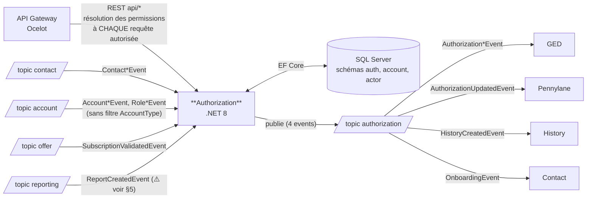

# Pulse.Back.Authorization — Architecture & Service Context

> **Document de contexte humain / agent IA.**
> L'inventaire factuel (endpoints, events publiés/consommés, handlers, projets, packages internes)
> est porté par [`architecture.graph.yaml`](./architecture.graph.yaml), **régénéré automatiquement sur `main`**
> par la pipeline ArchGraph, et consolidé dans `pulse.graph.yaml` (topics, subscriptions, consommateurs)
> et `events.catalog.yaml` (payloads des events) côté Pulse.Operations.Review.
> **Ne pas dupliquer ces listes ici** — ce document porte ce que le graphe ne dit pas :
> rôle métier, invariants, points d'attention, règles spécifiques.
>
> Point d'entrée agents : `AGENTS.md` (conventions) → ce fichier (contexte) → le graphe (facts).

---

## 1. Rôle du service

<!-- DRAFT: à relire par l'équipe -->

Le service **Authorization** est le référentiel des **permissions (codes d'autorisation)** des contacts sur les comptes de la plateforme Pulse.
Il gère :

- La **résolution des permissions** d'un contact (globales et par compte) — appelée par la **Gateway à chaque requête autorisée** (`GetAllContactAuthorizationsAsync`)
- Le référentiel des **codes de permission** (`auth.Authorization`, avec catégories) et les **personas** (jeux de permissions par défaut)
- La **configuration** des permissions : par contact sur un compte, et au niveau du compte lui-même
- L'attribution automatique de permissions à partir des events amont : création de compte, création/suppression de rôle, souscription d'offre validée, création de rapport
- L'attribution en masse d'une permission via import CSV d'emails
- Des **projections locales** des comptes, contacts et rôles (sources : services Account et Contact), alimentées exclusivement par events

C'est un service **critique** : la Gateway dépend de lui pour **chaque requête autorisée** de la plateforme.

### Vue d'ensemble des flux

> Vue synthétique **indicative** — la source de vérité de la topologie est le graphe consolidé `pulse.graph.yaml`.



---

## 2. Données possédées

| Entité | Description |
|--------|-------------|
| `AccountAuthorizationEntity` | Permissions activées au niveau d'un compte (`auth.AccountAuthorization`) |
| `AccountEntity` | Projection locale des comptes (`account.Account`, source : service Account) |
| `AuthorizationEntity` | Référentiel des codes de permission, avec catégorie (`auth.Authorization`) |
| `ContactAuthorizationEntity` | Permissions d'un contact sur un compte (`auth.ContactAuthorization`) |
| `ContactEntity` | Projection locale des contacts (`actor.Contact`, source : service Contact) |
| `PersonaEntity` | Personas = jeux de permissions par défaut (`auth.Persona` + table de liaison `auth.PersonaAuthorization`) |
| `RoleEntity` | Projection locale des rôles contact/compte (`account.Role`, source : service Account) |

- Base : **SQL Server** (projet SSDT `Authorization.Database`, schémas `auth`, `account`, `actor` ; référentiels initialisés par scripts post-déploiement)
- Accès : **EF Core** (`Authorization.Infrastructure/Context/AuthorizationContext`, `AddDbContextPool` + `EnableRetryOnFailure`, contexte scaffoldé EF Core Power Tools)

---

## 3. API exposée

**Liste exhaustive des endpoints : [`architecture.graph.yaml`](./architecture.graph.yaml)** (section
`managed_by_script.endpoints`). Contrat de référence : **OpenAPI** (Swashbuckle) —
`/authorization/api/v1/api.json` sur l'instance ; en cas de divergence, l'OpenAPI fait foi.

- Préfixe : `api/`. Authentification portée par la **Gateway** (header `CurrentUser` injecté) — pas de `[Authorize]` local.
- ⚠️ **Endpoint critique** : `GET api/authorizations` (`GetAllContactAuthorizationsAsync`) est appelé par la
  **Gateway pour chaque requête autorisée** — toute modification (route, paramètres, format `IList<string>`)
  impacte l'AuthorizationMiddleware de la Gateway (voir §9).

---

## 4. Events publiés

**Liste de référence : le graphe** (fragment + consolidé, croisés avec `servicebus.yaml` du repo infra —
source de vérité du déploiement). Ce qui suit est le **contexte métier** des publications.

Topic de publication : **`authorization`** (via `Pulse.Back.Events`, propriété de filtrage : `EventType`).

| Event | Déclencheur |
|-------|-------------|
| `AuthorizationCreatedEvent` | Première attribution de permissions à un contact (handler `ReportCreatedEvent`) |
| `AuthorizationUpdatedEvent` | Mise à jour de permissions : POST configuration (contact/compte), handlers `AccountCreatedEvent`, `RoleCreatedEvent`, `ReportCreatedEvent`, `SubscriptionValidatedEvent` (flag `FromOfferActivation`) |
| `HistoryCreatedEvent` | Modification de permissions par un utilisateur (`ConfigurationService`, diff codes ajoutés/supprimés) |
| `OnboardingEvent` | Onboarding d'un client lors de la création de son premier rôle (`RoleCreatedEventHandler`) |

> ⚠️ **Règle anti-régression** : ne jamais supprimer ni renommer un champ d'un event publié
> (breaking change silencieux pour tous les consommateurs, cf. graphe consolidé). Ajout de champ uniquement.
> Toute modification d'un event impacte ces services : les prévenir / tester.

---

## 5. Events consommés

**Liste exhaustive events consommés / handlers : le fragment** (`managed_by_script.events.consumes`) ;
producteurs, topics et subscriptions déployées : graphe consolidé.

- Subscriptions configurées dans `appsettings` (`PullTopics`) ; handlers enregistrés dans
  `ServicesConfiguration.cs` (keyed services par `EventType`).
- Les subscriptions `*-authorization` sur le topic `account` sont **sans filtre `AccountType`** :
  le service traite clients **et** prospects.
- ⚠️ **Anomalie détectée** : `appsettings.json` local déclare la subscription `subscription-validated-authorization`
  (topic `offer`), mais `servicebus.yaml` et la configuration des environnements déployés
  (`docs/conf-variables_Authorization.md`) définissent `offer-validated-authorization`. Le nom local est
  obsolète — en local, le pull viserait une subscription inexistante.
- ⚠️ **Anomalie détectée** : `ReportCreatedEventHandler` est enregistré (`ServicesConfiguration.cs`) et la
  subscription `reporting-created-authorization` existe côté infra (topic `reporting`), mais **aucun `PullTopic`
  `reporting` n'est configuré** ni dans `appsettings.json`, ni dans `docs/conf-variables_Authorization.md`.
  Le handler ne serait donc jamais déclenché et la subscription accumulerait des messages sans consommateur —
  à vérifier (config Azure App Configuration par environnement ?).

> Les handlers doivent être **idempotents** (vérifier l'existence avant `AddAsync`) —
> jamais de `catch (Exception) { return; }` (= perte de message).

---

## 6. Dépendances

> Versions des packages internes : fragment (`managed_by_script.internal_packages`).

| Type | Cible | Usage |
|------|-------|-------|
| Base de données | SQL Server (schémas `auth`, `account`, `actor`) | EF Core, projet SSDT `Authorization.Database`, auth Managed Identity |
| Messaging | Azure Service Bus | `Pulse.Back.Events` — push : `authorization` ; pull : `contact`, `account`, `offer` (+ `reporting` côté infra, voir anomalie §5) |
| Package Pulse | `Pulse.ExceptionMiddleware` | Gestion d'erreurs (**legacy**, voir §7) |
| Observabilité | Azure Monitor OpenTelemetry | Traces (source `Pulse.Back.Events`), Application Insights |
| Santé | AspNetCore.HealthChecks (SqlServer + UI) | Healthcheck SQL + UI |
| Résilience | Polly ; `EnableRetryOnFailure` EF Core | Retries |
| Identité | Managed Identity (`Azure.Identity`) | Accès Service Bus / SQL / Key Vault |
| Cache | `Microsoft.Extensions.Caching.Memory` | Cache mémoire local |
| Feature flags | **Aucun** | Pas de ConfigCat / OpenFeature |
| **Appels HTTP sortants** | **Aucun** | Pas de `AddHttpClient` — communication uniquement par events |

---

## 7. État migration

| Sujet | État actuel | Cible |
|-------|-------------|-------|
| .NET | **net8.0** (tous projets) | .NET 10 / C# 13 (migration en cours à l'échelle de la plateforme) |
| EF Core | 8.x | EF Core 10 |
| Exceptions | `Pulse.ExceptionMiddleware` (`UseExceptionMiddleware()` dans `Startup.cs`) | `IExceptionHandler` + ProblemDetails (RFC 9457) |
| Hosting model | `Startup.cs` + `Program.cs` (ancien modèle) | Minimal hosting (`Program.cs` seul) |

---

## 8. Structure & tests

```
01_authorization/
├── src/
│   ├── Authorization.API/            # Controllers, Startup, configuration (broker, DB, Swagger, OTel)
│   ├── Authorization.Core/           # Interfaces, modèles, requests, exceptions
│   ├── Authorization.Infrastructure/ # EF Core, repositories, services métier, publishers/handlers Service Bus
│   └── Authorization.Database/       # Projet SSDT (schémas auth/account/actor, scripts post-déploiement, mocks dev)
├── tests/
│   ├── Authorization.Api.Tests/
│   ├── Authorization.Core.Tests/
│   └── Authorization.Infrastructure.Tests/
├── docs/                             # conf-variables_Authorization.md (variables d'environnement)
└── pipelines/                        # CI/CD Azure DevOps (API + SQL : PR, Delivery, Hotfix, QuickDeploy)
```

Note : les services métier (`AuthorizationService`, `ConfigurationService`) sont dans `Authorization.Infrastructure/Services` (pas de couche Application — voir rapport qualité `_docs/rapport-qualite-code.md`).

---

## 9. Règles spécifiques au service

<!-- DRAFT: à relire par l'équipe -->

- **Impact Gateway (tier critical)** : la Gateway appelle ce service pour résoudre les permissions à **chaque requête autorisée** (`GET api/authorizations` → `GetAllContactAuthorizationsAsync`). Toute modification des endpoints de permissions (route, paramètres, format de réponse `IList<string>`) impacte directement l'**AuthorizationMiddleware de la Gateway** — coordonner tout changement avec l'équipe Gateway et tester le parcours complet.
- `AccountEntity`, `ContactEntity` et `RoleEntity` sont des **projections** alimentées par les events des services Account et Contact : ne jamais les modifier via l'API — uniquement via les handlers.
- Les subscriptions sur le topic `account` sont **sans filtre `AccountType`** : les handlers doivent gérer clients **et** prospects.
- Le référentiel des codes de permission (`auth.Authorization`) et les personas sont initialisés par les **scripts SQL post-déploiement** (`Authorization.Database/postDeployment`) : tout nouveau code de permission passe par ces scripts, pas par l'API.
- `AuthorizationUpdatedEvent` porte le flag `FromOfferActivation` lorsque la mise à jour provient d'une activation d'offre — les consommateurs (ged, pnl) s'appuient sur ce flag : ne pas en changer la sémantique.
